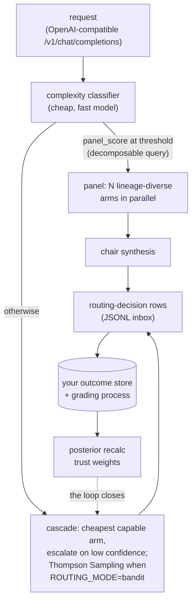

<div align="center">

# pdp-router

**An outcome-fed router for heterogeneous AI models.**

PDP = parallel distributed processing: many diverse processors, one judgment,
trust earned from recorded outcomes rather than configured by hand.

[](https://github.com/ryanmat/pdp-router/actions/workflows/ci.yml)
[](https://github.com/ryanmat/pdp-router/blob/main/pyproject.toml)
[](https://github.com/ryanmat/pdp-router/blob/main/LICENSE)
[](https://github.com/astral-sh/ruff)

</div>

This is the routing core of a personal multi-model system that routes
production alert-enrichment and chat traffic across nine models from three
providers. Every routing decision is logged; real outcomes flow back into
per-model, per-domain trust weights and Thompson Sampling posteriors; the
router gets better at knowing which model to trust for what. The premise:
models come and go, but the routing-and-feedback architecture is the durable
part.

## What this is (and is not)

This is a **reference implementation**, published as a working exhibit of
outcome-fed routing. It runs in production for its author. It is not a
supported product: no stability guarantees, no roadmap promises, and the repo
is a one-way mirror synced from a private upstream (see CONTRIBUTING). If you
want a batteries-included LLM gateway, use LiteLLM or OpenRouter; if you want
to see how a learned router with a real feedback loop fits together, read on.

## Honest results

Most router READMEs claim the learned router wins. Here is real data saying
it is not that simple.

At a 100% bandit-routing flip on one production domain, the bandit's
outcome rate was **0.800 vs the static confidence cascade's 0.893**
(n=80 graded decisions, Fisher exact p=0.017), monotonically worsening in
20-row windows. The flip was reverted to a 10% canary the same day, under a
tripwire pre-committed before the flip.

> [!IMPORTANT]
> The diagnosis is the most useful thing in this repo: the reward signal
> (did the alert clear?) was **blind to output quality** -- a model emitting
> garbage text was not penalized as long as the alert resolved. A learned
> router can only beat a good heuristic when its reward measures what you
> actually care about. The fix in the upstream system is a rubric-based
> judge ensemble as a second outcome source, soaking before it earns bandit
> weight.

Takeaways if you build on this:

1. The router is the easy part. **Outcome plumbing is the product.**
2. Pre-commit your revert tripwires before you flip traffic.
3. Audit your reward signal for blindness before trusting any win.

## Architecture



| Module | What it does |
|---|---|
| `_router.py` | Model registry, capability tiers, confidence cascade, trust-adjusted routing |
| `_bandit.py` | Thompson Sampling over (model, domain, context) with time-discounted observations |
| `_panel.py` | Parallel multi-model panel + chair synthesis, lineage diversity selection |
| `_clients.py` | Provider clients (Anthropic, Gemini, Vertex AI) behind one `LLMClient` protocol |
| `_proxy.py` | FastAPI OpenAI-compatible endpoint: classify, route, execute, log |
| `_cost.py` | Per-provider pricing and cost estimation |
| `_models.py` | Model ID constants and the live roster |
| `_tracing.py` | Optional OpenTelemetry export (traces, metrics, logs, GenAI instrumentation) |

The current roster spans Anthropic (Opus/Sonnet/Haiku), Google
(Gemini Pro/Flash/Flash-Lite), Meta Llama 4 (Scout/Maverick via Vertex AI),
and DeepSeek. The deliberate point is **cognitive diversity**: different
training lineages fail differently, and the panel selects across lineages
rather than stacking near-clones.

## Quickstart

```bash
git clone https://github.com/ryanmat/pdp-router && cd pdp-router
cp .env.example .env          # add your own API keys
uv sync --all-extras
uv run uvicorn pdp_router._proxy:app --host 127.0.0.1 --port 7741
```

Then point any OpenAI-compatible client at it:

```bash
curl -s http://127.0.0.1:7741/v1/chat/completions \
  -H 'Content-Type: application/json' \
  -d '{"model": "pdp-auto", "messages": [{"role": "user", "content": "hello"}]}'
```

`model: pdp-auto` engages routing; a concrete model ID pins that model.
`GET /v1/models` lists the roster, `GET /health` is what it looks like.

Works out of the box with just API keys: with no trust DB present, the
confidence cascade routes on defaults. The learned layer activates when you
bring outcomes (next section).

## Bring your own outcomes

The bandit and trust weights read from a SQLite DB (default
`~/.pdp-router/pdp_tracker.db`, override `PROXY_TRUST_DB`) that **your**
grading process populates:

```sql
CREATE TABLE model_trust (model_id TEXT, weight REAL);          -- 0.0-1.0
CREATE TABLE bandit_state (
  model_id TEXT, mu REAL, sigma REAL, n_obs INTEGER,
  sum_reward REAL, sum_sq_reward REAL,
  effective_n REAL, effective_sum REAL                          -- discounted
);
```

Every request appends a routing-decision row to a JSONL inbox (default
`~/.pdp-router/inbox/proxy-YYYYMMDD.jsonl`, override
`PROXY_ROUTING_INBOX_DIR`) carrying the selected model, confidence, context
bucket, and a request UUID that also rides the `X-PDP-Prediction-Id`
response header. Drain those rows into your store, grade them against
whatever outcome you care about, recompute posteriors, write them back.
That loop -- not this code -- is where the value lives.

## What is deliberately not here - You’re gonna carry that weight.

The upstream system's outcome store, judge ensemble and rubrics, drift
watchdog, and months of earned posteriors are not in this repo. They are
domain-specific by nature; publishing them would hand you the shape of my
loop without the substance of yours. The schema contract above is the
interface; closing the loop is the work.

## Further reading

- Chapelle & Li, *An Empirical Evaluation of Thompson Sampling* (NeurIPS 2011)
- Ong et al., *RouteLLM: Learning to Route LLMs with Preference Data* (arXiv:2406.18665)
- Verga et al., *Replacing Judges with Juries* (arXiv:2404.18796) -- multi-family
  judge panels and intra-family self-preference bias
- Snell et al., *Scaling LLM Test-Time Compute Optimally* (arXiv:2408.03314) --
  why parallel beats sequential at fixed budget

## License

MIT. Use it, fork it, learn from it. If you close the loop on your own
domain, that is the whole point. 

ARE YOU LIVING IN THE REAL WORLD?
