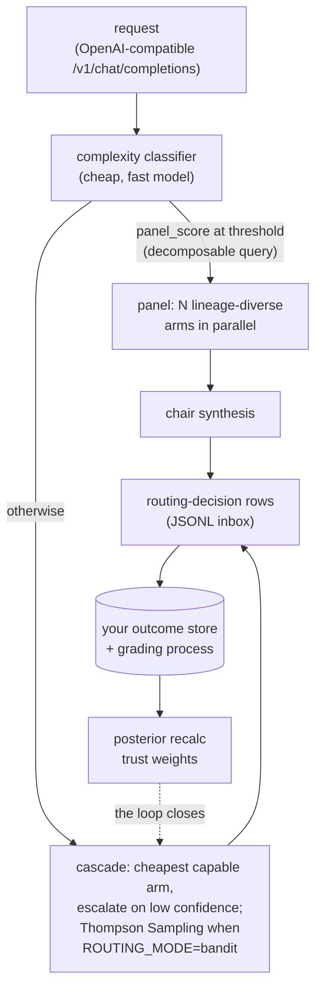

<div align="center">

# pdp-router

**An outcome-fed router for heterogeneous AI models.**

[](https://github.com/ryanmat/pdp-router/actions/workflows/ci.yml)
[](https://github.com/ryanmat/pdp-router/blob/main/pyproject.toml)
[](https://github.com/ryanmat/pdp-router/blob/main/LICENSE)
[](https://github.com/astral-sh/ruff)

</div>

pdp-router routes a single request across many AI models and learns, from real
outcomes, which model to trust for a given job. It starts from a confidence cascade, logs every routing
decision, and lets recorded outcomes reshape the trust weights and Thompson
Sampling posteriors behind future decisions. Point an OpenAI-compatible client
at it, and it picks the model, or convenes a panel of models, for you.

## Features

- **Outcome-fed.** Every routing decision is logged, and real outcomes flow back
  into per-model, per-domain trust weights and Thompson Sampling posteriors.
- **Confidence cascade.** Start at the cheapest capable model and escalate only
  when confidence is low. Pay for the big model when the question earns it.
- **Multi-model panel.** On hard queries, fan out to several lineage-diverse
  models in parallel and synthesize their answers with a chair model.
- **Two OpenAI-compatible surfaces.** A default one that reports the routed
  model inline, and a byte-faithful one that strict agent clients accept without
  knowing a router is there.
- **Cognitive diversity by design.** Eleven models across six training lineages,
  chosen because different lineages fail differently.
- **Bring your own outcomes.** Point it at a SQLite trust DB your grading
  process populates. With no DB, it routes on the static cascade.
- **Observability built in.** Optional OpenTelemetry traces, metrics, and GenAI
  instrumentation. Point `OTEL_EXPORTER_OTLP_ENDPOINT` at any OTLP collector,
  including LangSmith, with no extra dependency.

## Where it fits

LiteLLM and OpenRouter are excellent gateways for reaching many
models behind one API. pdp-router is a smaller, more opinionated thing: a
learned router with a real feedback loop wrapped around that idea. If you want a
gateway, use those. If you want a router that measures its own decisions and
improves from them, clone this and bring your outcomes.

## Current results

At a 100% bandit-routing flip on one production domain, the bandit's outcome
rate was 0.800 vs the static confidence cascade's 0.893 (n=80 graded
decisions, Fisher exact p=0.017), monotonically worsening in 20-row windows.
The flip was reverted to a 10% canary the same day, under a tripwire
pre-committed before the flip.

The reward signal (did the alert clear?) was blind to output quality. A model emitting garbage text was not penalized as long as the alert resolved. The fix upstream is a rubric-based judge ensemble as a second outcome source, soaking before it earns bandit weight. 

Takeaway: A learned router can only beat a good heuristic when its reward measures what the user actually cares about. 

## Architecture



| Module | What it does |
|---|---|
| `_router.py` | Model registry, capability tiers, confidence cascade, trust-adjusted routing |
| `_bandit.py` | Thompson Sampling over (model, domain, context) with time-discounted observations |
| `_panel.py` | Parallel multi-model panel and chair synthesis, lineage diversity selection |
| `_clients.py` | Provider clients (Anthropic, Gemini and Vertex AI, DeepSeek, OpenRouter) behind one `LLMClient` protocol |
| `_proxy.py` | FastAPI OpenAI-compatible endpoints: classify, route, execute, log. Two surfaces (default and OpenAI-faithful) |
| `_effort.py` | Maps the classifier complexity score to a per-provider reasoning-effort level |
| `_cost.py` | Per-provider pricing and cost estimation |
| `_models.py` | Model ID constants and the live roster |
| `_tracing.py` | Optional OpenTelemetry export (traces, metrics, logs, GenAI instrumentation) |

The roster spans six training lineages: Anthropic (Opus, Sonnet, Haiku), Google
(Gemini Pro, Flash, Flash-Lite), Meta Llama 4 (Scout and Maverick via Vertex
AI), DeepSeek, and OpenAI and Qwen via OpenRouter. Eleven models in total. The
deliberate point is **cognitive diversity**: different training lineages fail
differently, and the panel selects across lineages rather than stacking
near-clones.

## Quickstart

```bash
git clone https://github.com/ryanmat/pdp-router && cd pdp-router
cp .env.example .env          # add one provider key
uv sync --all-extras
uv run pdp-router-proxy
```

Then point any OpenAI-compatible client at it:

```bash
curl -s http://127.0.0.1:7741/v1/chat/completions \
  -H 'Content-Type: application/json' \
  -d '{"model": "pdp-auto", "messages": [{"role": "user", "content": "hello"}]}'
```

`model: pdp-auto` engages routing; a concrete model ID pins that model.
`GET /v1/models` lists the roster. `GET /health` reports which provider
credentials actually landed and whether a trust DB was found, so you can
confirm your setup without spending a request. Strict agent clients should use
the faithful surface at `/openai/v1/chat/completions`.

**One provider key is enough.** With only `ANTHROPIC_API_KEY` set, the Gemini
complexity classifier falls back cross-lineage to Haiku and routing works
normally; the arms you have no credentials for are simply never selected. With
no trust DB present, the confidence cascade routes on defaults. The learned
layer activates when you bring outcomes (next section).

`uv run pdp-router-proxy` is the launch path that reads `.env`. If you invoke
uvicorn directly, either export the variables yourself or use
`uv run --env-file .env uvicorn pdp_router._proxy:app`. Real environment
variables always take precedence over the file.

> **No authentication.** The proxy binds `127.0.0.1` and has no auth, no rate
> limiting, and no quota. Anything that can reach the port can spend your
> provider credits. Put your own auth in front of it before exposing it
> anywhere, and treat `PROXY_HOST=0.0.0.0` as a deliberate decision.

The panel, streaming, effort routing, and web search are opt-in. Turn them on
with environment variables (see `.env.example`); for example
`PROXY_AUTOPANEL_ENABLED=1` convenes the panel on hard queries. Defaults are
conservative: a fresh clone runs the single-model cascade until you enable the
extras.

## Bring your own outcomes

The bandit and trust weights read from a SQLite DB (default
`~/.pdp-router/pdp_tracker.db`, override `PROXY_TRUST_DB`) that **your** grading
process populates:

```sql
CREATE TABLE model_trust (model_id TEXT, weight REAL);          -- 0.0-1.0
CREATE TABLE bandit_state (
  model_id TEXT, mu REAL, sigma REAL, n_obs INTEGER,
  sum_reward REAL, sum_sq_reward REAL,
  effective_n REAL, effective_sum REAL                          -- discounted
);
```

Every request appends a routing-decision row to a JSONL inbox (default
`~/.pdp-router/inbox/proxy-YYYYMMDD.jsonl`, override `PROXY_ROUTING_INBOX_DIR`).
Drain those rows into your store, grade them against whatever outcome you care
about, recompute posteriors, write them back. That loop, not this code, is where
the value lives.

Reading a row, the three fields that matter most:

| Field | Meaning |
|---|---|
| `context_json.chat_request_id` | **Join on this.** The request UUID, identical to the `X-PDP-Prediction-Id` response header. `alert_id` carries it too, as `chat-<uuid>`. |
| `routing_mode` | The policy that actually produced the pick: `bandit` when Thompson Sampling ran, `cascade` for the thresholds, `explicit` when the caller pinned a model, `panel`/`panel_chair` for panel rows. Group by this to compare policies. |
| `cascade_explored` | `true` when the pick came from the epsilon-greedy explore branch and is uniform-random rather than threshold-driven. Exclude these before computing agreement rates. |

`prediction_id` is a literal `0`, not an identifier. It is a sentinel for "no
upstream prediction id" and joining on it will match every row.

Configuring `ROUTING_MODE=bandit` is not the same as the bandit running: with no
readable `bandit_state` table, routing silently falls through to the cascade. The
proxy warns at startup when that happens, and `routing_mode` on each row records
which policy actually served the request.

## Tracing

Nothing is exported and no GenAI instrumentation is loaded until you set an OTLP
endpoint. Any OTLP-compatible backend works. LangSmith needs no SDK and no extra
dependency, just two variables:

```bash
OTEL_EXPORTER_OTLP_ENDPOINT=https://api.smith.langchain.com/otel
OTEL_EXPORTER_OTLP_HEADERS=x-api-key=<your-key>,Langsmith-Project=pdp-router
```

Traces carry the routing decision, token usage, latency, and cost per arm.
Prompt and completion **text** is not recorded unless you set
`OTEL_CAPTURE_CONTENT=1`, because turning that on ships the content of every
request and response to your backend.

## Further reading

- Chapelle & Li, *An Empirical Evaluation of Thompson Sampling* (NeurIPS 2011)
- Ong et al., *RouteLLM: Learning to Route LLMs with Preference Data* (arXiv:2406.18665)
- Verga et al., *Replacing Judges with Juries* (arXiv:2404.18796), on multi-family
  judge panels and intra-family self-preference bias
- Snell et al., *Scaling LLM Test-Time Compute Optimally* (arXiv:2408.03314), on
  why parallel beats sequential at fixed budget

## License

Apache-2.0. See [LICENSE](LICENSE).

---

ARE YOU LIVING IN THE REAL WORLD?
