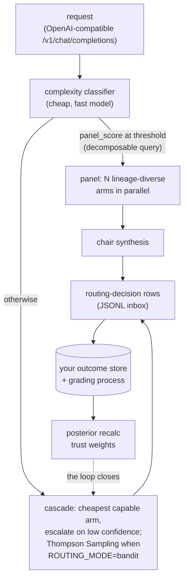

# pdp-router

An outcome-fed router for heterogeneous AI models: a confidence cascade, a
Thompson Sampling bandit, and a multi-model panel behind two OpenAI-compatible
surfaces.

[](https://github.com/ryanmat/pdp-router/actions/workflows/ci.yml)

## Overview

pdp-router sits behind an OpenAI-compatible endpoint and decides, per request,
which model answers. A cheap classifier scores request complexity. A confidence
cascade starts at the cheapest capable model and escalates only when confidence
is low; with `ROUTING_MODE=bandit`, Thompson Sampling over per-model,
per-domain posteriors makes the pick instead. Decomposable queries can convene
a panel of lineage-diverse models in parallel, with a chair model synthesizing
the answers. Every routing decision is logged as a JSONL row. Grade those rows
against outcomes you care about, write the results back to a SQLite trust DB,
and the trust weights and posteriors reshape future routing. With no trust DB,
it routes on the static cascade.

LiteLLM and OpenRouter are gateways: many models behind one API. pdp-router is
a smaller, more opinionated thing built on the same idea: a learned router with
a measured feedback loop. If you want a gateway, use those. If you want a
router that logs its decisions and improves from graded outcomes, this is a
reference implementation of that, extracted from a production system.

The roster is thirteen models across six training lineages: Anthropic (Opus,
Sonnet, Haiku), Google (Gemini Pro, Flash, Flash-Lite), Meta Llama 4 (Scout
and Maverick via Vertex AI), DeepSeek, and OpenAI and Qwen via OpenRouter. The
lineage spread is deliberate: different training lineages fail differently,
and the panel selects across lineages rather than stacking near-clones.

## Results

At a 100% bandit-routing flip on one production domain, the bandit's outcome
rate was 0.800 vs the static confidence cascade's 0.893 (n=80 graded
decisions, Fisher exact p=0.017), monotonically worsening in 20-row windows.
The flip was reverted to a 10% canary the same day, under a tripwire
pre-committed before the flip.

The reward signal (did the alert clear?) was blind to output quality. A model
emitting garbage text was not penalized as long as the alert resolved. The fix
upstream is a rubric-based judge ensemble as a second outcome source, soaking
before it earns bandit weight.

A learned router beats a good heuristic only when its reward measures what the
user actually cares about.

## Architecture



| Module | What it does |
|---|---|
| `_router.py` | Model registry, capability tiers, confidence cascade, trust-adjusted routing |
| `_bandit.py` | Thompson Sampling over (model, domain, context) with time-discounted observations |
| `_panel.py` | Parallel multi-model panel and chair synthesis, lineage diversity selection |
| `_clients.py` | Provider clients (Anthropic, Gemini and Vertex AI, DeepSeek, OpenRouter) behind one `LLMClient` protocol |
| `_proxy.py` | FastAPI OpenAI-compatible endpoints: classify, route, execute, log. Two surfaces (default and OpenAI-faithful) |
| `_effort.py` | Maps the classifier complexity score to a per-provider reasoning-effort level |
| `_cost.py` | Per-provider pricing and cost estimation |
| `_models.py` | Model ID constants and the live roster |
| `_tracing.py` | Optional OpenTelemetry export (traces, metrics, logs, GenAI instrumentation) |

## Setup

Python 3.11 to 3.13.

```bash
git clone https://github.com/ryanmat/pdp-router && cd pdp-router
cp .env.example .env          # add one provider key
uv sync --all-extras
```

Tests and lint are hermetic: no network, no databases, no credentials.

```bash
uv run pytest -q
uv run ruff check .
```

## Usage

```bash
uv run pdp-router-proxy
```

Then point any OpenAI-compatible client at it:

```bash
curl -s http://127.0.0.1:7741/v1/chat/completions \
  -H 'Content-Type: application/json' \
  -d '{"model": "pdp-auto", "messages": [{"role": "user", "content": "hello"}]}'
```

`model: pdp-auto` engages routing; a concrete model ID pins that model.
`GET /v1/models` lists the roster. `GET /health` reports which provider
credentials actually landed and whether a trust DB was found, so you can
confirm your setup without spending a request.

Two surfaces: `/v1/chat/completions` reports the routed model inline in the
`model` field; `/openai/v1/chat/completions` is byte-faithful for strict agent
clients that reject responses naming a model they did not request.

One provider key is enough. With only `ANTHROPIC_API_KEY` set, the Gemini
complexity classifier falls back cross-lineage to Haiku and routing works
normally; the arms you have no credentials for are never selected. With no
trust DB present, the confidence cascade routes on defaults. The learned layer
activates when you bring outcomes (below).

`uv run pdp-router-proxy` is the launch path that reads `.env`. If you invoke
uvicorn directly, either export the variables yourself or use
`uv run --env-file .env uvicorn pdp_router._proxy:app`. Real environment
variables always take precedence over the file.

> No authentication. The proxy binds `127.0.0.1` and has no auth, no rate
> limiting, and no quota. Anything that can reach the port can spend your
> provider credits. Put your own auth in front of it before exposing it
> anywhere, and treat `PROXY_HOST=0.0.0.0` as a deliberate decision.

## Configuration

Defaults are conservative: a fresh clone runs the single-model cascade. The
panel, streaming, effort routing, web search, and tool passthrough are opt-in
environment toggles, documented in `.env.example`. For example,
`PROXY_AUTOPANEL_ENABLED=1` convenes the panel on hard queries.

### Outcomes

The bandit and trust weights read from a SQLite DB (default
`~/.pdp-router/pdp_tracker.db`, override `PROXY_TRUST_DB`) that your grading
process populates:

```sql
CREATE TABLE model_trust (model_id TEXT, weight REAL);          -- 0.0-1.0
CREATE TABLE bandit_state (
  model_id TEXT, mu REAL, sigma REAL, n_obs INTEGER,
  sum_reward REAL, sum_sq_reward REAL,
  effective_n REAL, effective_sum REAL                          -- discounted
);
```

Every request appends a routing-decision row to a JSONL inbox (default
`~/.pdp-router/inbox/proxy-YYYYMMDD.jsonl`, override `PROXY_ROUTING_INBOX_DIR`).
Drain those rows into your store, grade them against whatever outcome you care
about, recompute posteriors, write them back. The router is only as good as
this loop.

Reading a row, the fields that matter most:

| Field | Meaning |
|---|---|
| `context_json.chat_request_id` | Join on this. The request UUID, identical to the `X-PDP-Prediction-Id` response header. `alert_id` carries it too, as `chat-<uuid>`. |
| `model_selected` | The model that served the request. Group outcomes by this to grade per model. |
| `routing_mode` | The policy that actually produced the pick: `bandit` when Thompson Sampling ran, `cascade` for the thresholds, `explicit` when the caller pinned a model, `panel`/`panel_chair` for panel rows. Group by this to compare policies. |
| `cascade_explored` | `true` when the pick came from the epsilon-greedy explore branch and is uniform-random rather than threshold-driven. Exclude these before computing agreement rates. |

`prediction_id` is a literal `0`, not an identifier. It is a sentinel for "no
upstream prediction id" and joining on it will match every row.

Configuring `ROUTING_MODE=bandit` is not the same as the bandit running: with no
readable `bandit_state` table, routing silently falls through to the cascade. The
proxy warns at startup when that happens, and `routing_mode` on each row records
which policy actually served the request.

### Tracing

Nothing is exported and no GenAI instrumentation is loaded until you set an OTLP
endpoint. Any OTLP-compatible backend works. LangSmith needs no SDK and no extra
dependency, just two variables:

```bash
OTEL_EXPORTER_OTLP_ENDPOINT=https://api.smith.langchain.com/otel
OTEL_EXPORTER_OTLP_HEADERS=x-api-key=<your-key>,Langsmith-Project=pdp-router
```

Traces carry the routing decision, token usage, latency, and cost per arm.
Prompt and completion text is not recorded unless you set
`OTEL_CAPTURE_CONTENT=1`, because turning that on ships the content of every
request and response to your backend.

## Further reading

- Chapelle & Li, *An Empirical Evaluation of Thompson Sampling* (NeurIPS 2011)
- Ong et al., *RouteLLM: Learning to Route LLMs with Preference Data* (arXiv:2406.18665)
- Verga et al., *Replacing Judges with Juries* (arXiv:2404.18796), on multi-family
  judge panels and intra-family self-preference bias
- Snell et al., *Scaling LLM Test-Time Compute Optimally* (arXiv:2408.03314), on
  why parallel beats sequential at fixed budget

## License

Apache-2.0. See [LICENSE](LICENSE).

---

ARE YOU LIVING IN THE REAL WORLD?
